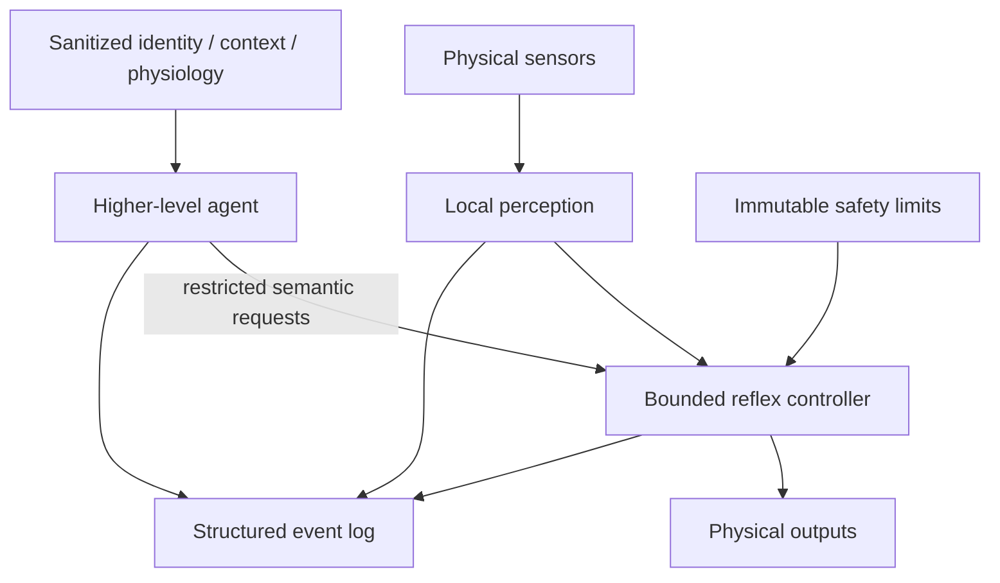

# Embodied AI Reflex Layer

An early-stage research project exploring how a persistent AI agent can participate in **safe, context-sensitive embodied interaction** while safety-critical actuation remains bounded by deterministic local control.

The first prototype is intentionally small: a benchtop human-touch reflex rig using multimodal sensing, bounded physical responses, and controlled thermal feedback. It is not a humanoid robot, and this project does not claim novelty in tactile sensing, robot reflexes, or warm robot surfaces individually.

## Research question

**Can an embodied system detect and characterize human-directed physical contact, produce an immediate bounded bodily response, and preserve a semantic account of the interaction for higher-level AI reasoning?**

A later research direction will examine whether higher-level interaction context — including authenticated identity signals and conservatively represented physiological measurements — can alter social responses while universal safety constraints remain unchanged.

## Working thesis

This project explores a layered embodied-AI architecture:

1. **Deterministic safety layer** — owns hard limits, fault handling, and fail-safe behavior.
2. **Local reflex layer** — converts physical signals into immediate bounded responses.
3. **Higher-level agent layer** — may influence social behavior through a restricted interface, but cannot bypass local safety constraints.

The near-term goal is to test whether this separation produces useful, measurable embodied behavior before attempting more complex hardware.

## High-level architecture



The public repository intentionally documents interfaces and experimental results at a high level. Implementation details that may affect future IP strategy are not published by default.

## Ecosystem strategy

The project is **model- and vendor-agnostic by design**.

LeRobot is currently being used as an interoperability target because it provides an open hardware interface and a standardized dataset format for robot-learning workflows. MolmoAct 2 is one candidate policy that can operate within that ecosystem; it is not a required dependency or the core of the product architecture.

The project should preserve the ability to:
- run deterministic local control without any learned policy;
- evaluate multiple learned policies over time;
- export experiment data to common open formats;
- change model providers without redesigning the physical embodiment interface.

See [`docs/interoperability.md`](docs/interoperability.md).

## V0 hardware categories

The first prototype remains modular and inexpensive. Current hardware categories include:

- microcontroller / embedded controller
- capacitive or proximity sensing
- force / pressure sensing
- temperature sensing
- low-voltage heater control
- one small thermal output
- breadboard / wiring / passive components
- an existing educational motor rig for a single-axis reflex

Wearable signals are treated as a separate higher-level context source rather than part of the V0 reflex hardware.

Exact component selection, calibration values, thresholds, and control tuning may change during characterization.

## Safety principles

1. **Safety is invariant.** Identity, relationship, conversation context, and physiological measurements must never weaken physical safety limits.
2. **No unrestricted model actuation.** High-level AI output is translated through a restricted interface before local execution.
3. **Fail safe locally.** Sensor failure, controller fault, invalid commands, or communication loss must resolve to a safe state without depending on a cloud model.
4. **Interpret physical and physiological signals conservatively.** Measurements are not treated as proof of social intent, emotion, diagnosis, or medical state.
5. **Thermal testing begins off-body.** Human-contact heating occurs only after measured regulation and independent protection are demonstrated.
6. **Identity is multimodal and confidence-based.** No single proximity, possession, biometric, or behavioral signal should automatically establish full identity or authorization.
7. **Proximity is not authentication.** A nearby wearable, phone, or similar device may contribute to identity confidence but must not, by itself, unlock sensitive personal context, privileged robot behaviors, configuration changes, or account-level actions.
8. **Physiology may inform appropriateness, not safety authority.** Heart rate or other wearable measurements may inform higher-level response selection, but they do not change actuator limits or bypass local safety.
9. **Conversation stays out of the low-level controller.** Raw conversation logs are not forwarded to embedded control hardware.
10. **Requested and executed behavior are logged separately.** Safety clamps and substitutions must be visible in the data.

See [`docs/safety.md`](docs/safety.md) for the current public safety boundary and [`docs/research-principles.md`](docs/research-principles.md) for the project-wide research rules.

## Planned V0 experiment

### Stage 1 — sensing characterization

Characterize representative human-contact interactions and determine whether the selected sensors provide repeatable, useful signals.

### Stage 2 — bounded motor reflex

Demonstrate a simple single-axis toward/away physical response using deterministic local control.

### Stage 3 — thermal channel

Add one regulated thermal zone and characterize response time, stability, and safety off-body before any human-contact use.

### Stage 4 — higher-level agent interface

Expose structured physical-interaction events to a higher-level agent and accept only restricted, bounded response requests back into the local controller.

### Later extension — context-sensitive behavior

Once the hardware is repeatable, test whether higher-level interaction context — potentially including identity confidence, interaction context, and conservatively represented physiological measurements — can produce measurably different but equally safe physical behavior.

## Public data strategy

Only sanitized, non-sensitive experimental data will be published.

The public schema is defined in [`data/schema.md`](data/schema.md). The schema is intentionally **LeRobot-aware without being LeRobot-dependent**: episode/frame structure, observations, actions, timestamps, and task annotations are preserved so later conversion into LeRobotDataset v3 or another learning stack does not require discarding the original experiment record.

Raw conversational content, identifying biometric data, device identifiers, private relationship data, secrets, calibration files that expose unpublished control methods, and intentionally withheld implementation details are excluded from the public repository.

Physiological measurements are optional context fields. They should be minimized, timestamped, and interpreted conservatively. Missing values remain `null`; physiological measurements must not be converted into unsupported emotional or medical labels.

## Success criteria

V0 succeeds if it can:

- repeatably detect relevant contact events;
- execute repeatable bounded motor responses;
- characterize and safely regulate one thermal zone;
- log observations, event labels, requested responses, executed responses, and safety interventions;
- preserve a clean boundary between higher-level agent behavior and local safety enforcement;
- preserve enough episode/frame structure to support later export into standard robot-learning datasets.

## Prior art and related work

This project does **not** claim to invent tactile sensing, tactile-reactive manipulation, distributed robot reflexes, thermal/tactile skin, or learned robot control.

Relevant work includes:

- Zhou et al. (2026), tactile-reactive grippers  
  https://doi.org/10.1038/s44182-026-00079-y
- EmArm, whole-arm tactile sensing and adaptive manipulation  
  https://www.nature.com/articles/s44460-026-00097-1
- Del Dottore et al. (2026), distributed local reflex-like behavior in an octopus-inspired arm  
  https://doi.org/10.1038/s42256-026-01230-y
- Hugging Face LeRobot, open robotics interfaces, datasets, and policy tooling  
  https://huggingface.co/docs/lerobot
- Ai2 MolmoAct 2, one open action-reasoning policy available through LeRobot  
  https://allenai.org/blog/molmoact2  
  https://github.com/allenai/molmoact2

MolmoAct 2 is not part of the V0 fast reflex or safety loop. Learned embodied models may be evaluated later at a higher policy layer, and the project is not committed to a single policy family.

## Why build in public

A public repository provides a timestamped, inspectable record of the research question, safety philosophy, experiment design, and results. Public documentation will be selective: enough to make the work reproducible at the research level where appropriate, without automatically publishing every implementation detail.

## Repository layout

```text
.
├── README.md
├── firmware/
├── data/
│   ├── README.md
│   └── schema.md
└── docs/
    ├── experiment-v0.md
    ├── interoperability.md
    ├── research-principles.md
    └── safety.md
```

## Status

**V0 — specification / procurement / benchtop setup**

No performance claims yet. Results will be added only after hardware characterization and repeatable tests.
