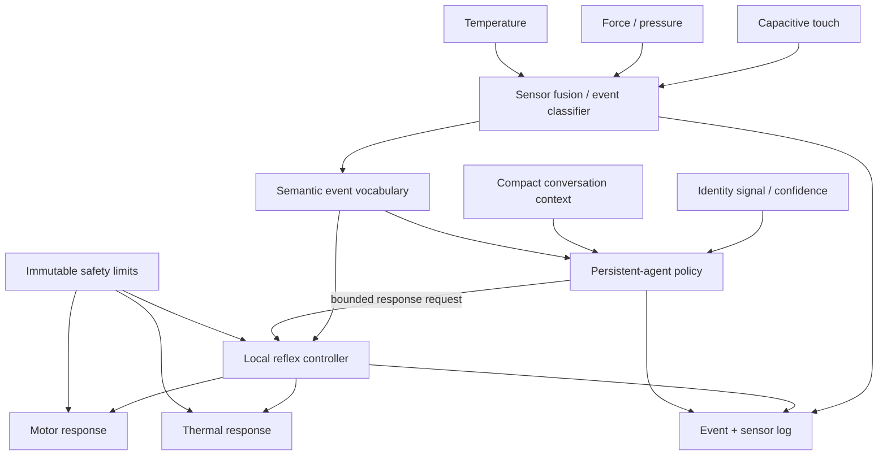

# Embodied AI Reflex Layer

An early-stage research prototype exploring how a persistent AI agent can participate in **identity- and context-sensitive embodied reflexes** while all safety-critical actuation remains bounded by deterministic local control.

This repository begins with a deliberately small V0: a benchtop human-touch reflex rig using multimodal sensing, bounded motor response, and controlled thermal feedback. It is not a humanoid robot and does not claim novelty in tactile sensing, robot reflexes, or warm robot surfaces individually.

## Research question

**Can an embodied system distinguish likely human-directed physical contact, characterize the physical interaction, and produce an immediate bounded bodily response while preserving the event for higher-level AI reasoning?**

Extension question:

**Can identical physical contact produce measurably different but equally safe embodied responses when person identity and conversational context differ, and does that increase perceived intentionality or relationship-specific responsiveness?**

## Working thesis

Most robot-control stacks either keep tactile reaction at the low-level controller or place learned policies directly in the action loop. This project explores a layered alternative:

1. **Deterministic safety layer** owns hard limits and fail-safe behavior.
2. **Local reflex layer** converts physical signals into bounded semantic events and immediate safe responses.
3. **Persistent-agent policy layer** may select or revise high-level social responses using identity and compact conversational context, but cannot bypass local safety constraints.

The candidate contribution is the interface between those layers: multimodal touch → semantic physical-interaction event → bounded embodied response → higher-level persistent-agent reasoning.

## Architecture



### Initial semantic event vocabulary

`PROXIMITY` · `CONTACT_START` · `LIGHT_CONTACT` · `PRESS` · `RAPID_HIGH_FORCE_CONTACT` · `SUSTAINED_HOLD` · `RELEASE` · `CONTACT_END`

Raw capacitance, force, force-rate, duration, temperature, and confidence remain available for logging. Physical force is not treated as proof of social intent.

### Initial bounded response vocabulary

`NO_RESPONSE` · `ORIENT_TOWARD` · `YIELD` · `WITHDRAW` · `HOLD_POSITION` · `WARM_SLOW` · `MAINTAIN_WARMTH` · `RETURN_TO_BASELINE`

The higher-level agent may request responses from this bounded vocabulary. It does **not** directly command unrestricted torque, travel, heater voltage, PWM duty cycle, or maximum temperature.

## V0 hardware BOM

The first prototype should remain modular, inexpensive, and easy to change before any custom PCB work.

| Component | Qty | Purpose |
|---|---:|---|
| ESP32-S3 development board | 1 | Local sensing, event classification, communications, reflex control |
| MPR121 or equivalent 3.3 V I²C capacitive-touch breakout | 1 | Human-contact / proximity evidence |
| Conductive electrode material | 1 | Touch electrode; foil acceptable for first tests |
| Force-sensitive resistor (FSR) | 1 | Force magnitude / rate / duration |
| MCP9808 or equivalent digital temperature sensor | 1 | Closed-loop thermal measurement |
| Logic-level MOSFET driver | 1 | Low-voltage resistive heater switching |
| Flexible resistive heater, approx. 5 V and ≤1 A | 1 | Controlled surface warmth |
| Breadboard + jumper wires | 1 set | V0 prototyping |
| 10 kΩ 1/4 W resistors | several | Signal conditioning / pullups as needed |
| 22 AWG solid hookup wire | as needed | Wiring |
| USB data cable | 1 | Programming / power as appropriate |
| Existing LEGO / educational motor rig | 1 | First single-axis toward/away reflex; no new motion hardware required initially |

**Before human-contact heating:** add an independently verified hardware thermal cutoff appropriate to the characterized heater and surface construction.

## Safety principles

1. **Safety is invariant.** Identity, relationship, and conversation context never weaken force, temperature, current, speed, travel, or fault limits.
2. **No unrestricted model actuation.** Model output is translated into a small bounded response vocabulary before local execution.
3. **Fail safe locally.** Sensor failure, controller fault, overtemperature, or invalid command must resolve to a safe state without depending on a cloud model.
4. **Interpret physical signals conservatively.** High force is a physical measurement, not automatically aggression or intent.
5. **Thermal testing begins off-body.** Human-contact testing happens only after measured regulation and independent protection are demonstrated.
6. **Identity is probabilistic.** V0 may use an experimenter-assigned or authenticated external identity signal; touch alone is not treated as biometric proof.
7. **Conversation stays out of the low-level controller.** The body receives a compact semantic state, not raw conversation logs.
8. **Log requested vs. executed behavior separately.** The system should preserve raw input, semantic event, requested response, bounded execution, and measured outcome.

## Planned V0 experiment

### Stage 1 — sensing characterization

Collect and inspect signals for:

- approach / proximity
- light contact
- firm contact
- sustained hold
- rapid / high-force contact
- release

Goal: determine whether capacitive + force sensing provides a useful first-pass representation of likely human contact and physical interaction type.

### Stage 2 — single-axis reflex

Using an existing educational/LEGO motor rig:

- gentle likely-human contact → small bounded orientation toward contact
- rapid/high-force contact → small bounded withdrawal

Goal: demonstrate an immediate deterministic reflex without a large model in the control loop.

### Stage 3 — thermal channel

Add one regulated thermal zone:

- sustained gentle contact may request `WARM_SLOW`
- continued safe contact may request `MAINTAIN_WARMTH`
- release returns the zone toward baseline

Goal: characterize a safe, measurable, context-sensitive physical response rather than simply making the surface warmer.

### Stage 4 — persistent-agent interface

Expose semantic events and measured outcomes to a higher-level persistent agent. The agent may choose among approved high-level social responses; the local controller remains authoritative over execution limits.

### Later extension — identity and conversational context

Hold the physical touch constant while varying:

- authenticated / experimenter-assigned person identity
- compact interaction-context state

Measure whether different **equally safe** responses increase perceived intentionality, responsiveness, and relationship-specific behavior.

## Success criteria

V0 succeeds if it can:

- repeatably detect contact;
- obtain useful multimodal evidence of likely human contact;
- distinguish gentle/sustained contact from rapid/high-force contact;
- execute repeatable bounded toward/away motion;
- characterize and safely regulate one thermal zone;
- log raw inputs, semantic events, requested responses, and measured outputs;
- preserve a clean interface for later learned-policy / persistent-agent integration;
- preserve identity/context as higher-level inputs without allowing either to bypass local safety constraints.

## Prior art and related work

This project does **not** claim to invent tactile sensing, tactile-reactive manipulation, distributed robot reflexes, thermal/tactile skin, or learned robot control. Relevant current work includes:

- **Tactile-reactive grippers:** Zhou et al. (2026) combine an actuated tactile palm with compliant fingers and tactile arrays for adaptive, contact-rich manipulation.  
  https://doi.org/10.1038/s44182-026-00079-y
- **Whole-arm tactile sensing / adaptive manipulation:** EmArm integrates large-area soft tactile skins, proprioception, and closed-loop control for touch-driven adaptation and trajectory replanning in human-involved environments.  
  https://www.nature.com/articles/s44460-026-00097-1
- **Distributed local reflexes:** Del Dottore et al. (2026) demonstrate an octopus-inspired arm with distributed sensing, local reflex-like behaviors, and higher-level coordination.  
  https://doi.org/10.1038/s42256-026-01230-y
- **MolmoAct 2 / open action reasoning:** Ai2 released MolmoAct 2 as an open family of action-reasoning models for real-world robot control. Ai2 has released model checkpoints, training and post-training code, datasets, evaluation assets, and LeRobot integration specifically to support adaptation to new robot embodiments and tasks.  
  https://allenai.org/blog/molmoact2  
  https://github.com/allenai/molmoact2

MolmoAct 2 is **not yet part of V0 control**. V0 intentionally keeps the fast reflex and safety loop deterministic. A later milestone can evaluate whether MolmoAct 2 or another embodied model adds value at the higher-level policy layer without replacing local safety enforcement.

## Why build in public

A public repository makes the research question, safety boundary, experiment design, and negative results inspectable from the beginning. It also creates a clean path to evaluate open embodied-AI tooling such as Ai2's MolmoAct 2 and Hugging Face LeRobot as the prototype progresses beyond deterministic V0 reflexes.

## Repository layout

```text
.
├── README.md
├── firmware/
│   └── .gitkeep
├── data/
│   └── .gitkeep
└── docs/
    ├── experiment-v0.md
    └── safety.md
```

## Status

**V0 — specification / procurement / benchtop setup**

No performance claims yet. Results will be added only after hardware characterization and repeatable tests.
